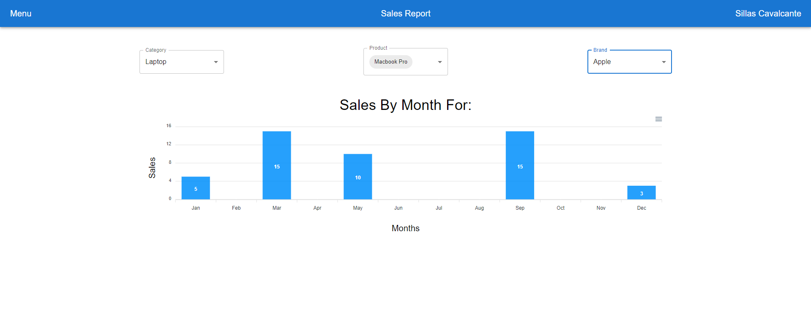

# Sales Report

Desafio `All Tax Platform`.



## Instalação

Execute os comandos abaixo para obter esse repositório.

```bash
> git clone https://github.com/sillasHead/sales-report.git
> cd sales-report
```

## Execução

Para inicializar o backend do projeto, execute o seguinte comando:

```bash
> mvn spring-boot:run
```

Para subir a aplicação web do projeto, execute os seguites comandos:

```bash
> yarn
> yarn start
```

Você pode acessar http://localhost:3000 para visualizá-la.